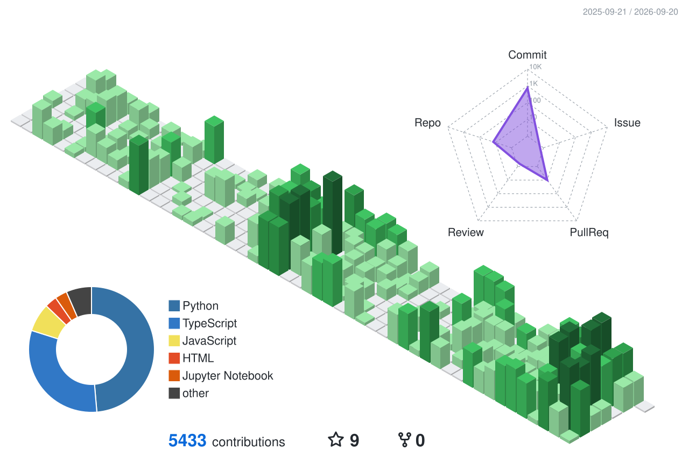

  

## 🏗️ Currently Building

### Chiron — A Private AI Endurance Coach

An iOS app that reads my own training data and answers questions about it: whether pace is drifting away from heart rate, how this week's load compares to the ramp, whether the fatigue in my notes shows up in the numbers.

**How it works:** Strava activities and Apple Health metrics land in a Postgres-backed Spring Boot service → the Flutter client streams answers from a coach that reasons over that history instead of giving generic fitness advice.

**Built with:**
`Flutter` `Dart` `Riverpod` `Java 21` `Spring Boot 3` `PostgreSQL` `Flyway` `OpenAI` `Gemini`

**The engineering I'm actually practicing here:**
- **Two repos joined by a machine-checked contract** — the client vendors the backend's generated OpenAPI spec, and a test suite binds every operation to the Dart that calls it and the Dart that parses the response. A backend change that would break the shipped app turns the client's CI red.
- **A compatibility verdict, not a diff** — each spec change is classified by what it does to a client already in the field (breaking / restricting / additive), and a shape the rules don't model fails the gate rather than falling through to a reassuring answer.
- **Ports and adapters** — Strava ingestion, HealthKit sync, and two LLM providers each sit behind their own boundary.
- **Streaming chat over SSE**, with cancellable in-flight responses and persisted conversations.

*Both repos are private while this is in development.*

---

## 📦 Shipped

### [AI Resume Tailor](https://www.re-zoo-me.com) — Land More Interviews with AI

A full-stack webapp that tailors your resume to any job description and scores it against real ATS systems.

**How it works:** Pick a job from the built-in job board or paste any job description → AI analyzes keyword gaps, role alignment, and formatting.

🔗 **Try it live (Chrome-only):** [re-zoo-me.com](https://www.re-zoo-me.com)

**Built with:**
`Next.js` `TypeScript` `FastAPI` `Python` `MongoDB` `PostgreSQL` `Redis`

**Key features:**
- Block-based resume editor with drag-to-reorder
- Multi-stage ATS scoring pipeline
- One-click PDF export via WeasyPrint
